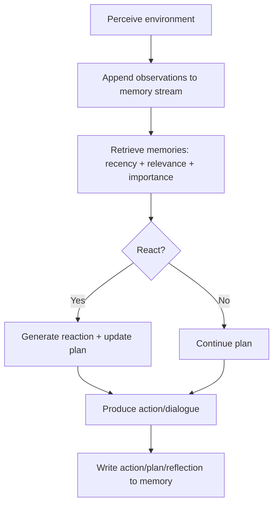
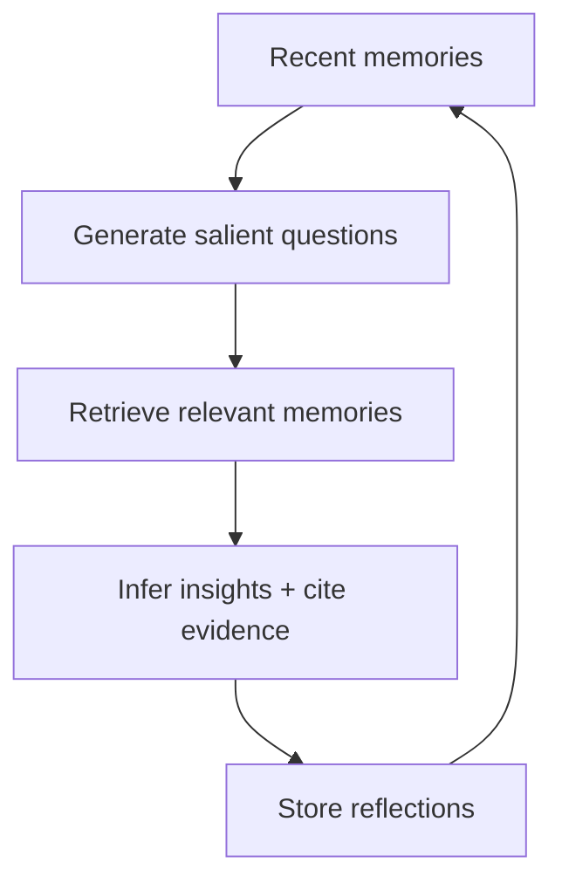

# Generative Agents (UIST 2023) - Focus on Simulation + Memory

Source: https://arxiv.org/pdf/2304.03442

## Executive summary
The paper introduces "generative agents": LLM-driven characters in a sandbox world that behave believably over time. The core contribution is an agent architecture that records experiences in natural language, retrieves relevant memories using a weighted scoring scheme, synthesizes reflections, and produces plans that guide moment-to-moment actions. This memory-first design makes long-term, coherent behavior possible in an open world where agents interact, remember, and coordinate.

## System overview (what runs each time step)
At each simulation tick, an agent:
1. Perceives the local environment (objects + nearby agents).
2. Stores these observations in its memory stream.
3. Retrieves the most relevant memories for the current context.
4. Uses retrieved memories + current context to decide whether to react.
5. Produces an action (or dialogue) and updates its plan if needed.
6. Writes the action and any reflections/plans back into memory.

## Memory stream (the backbone)
The memory stream is an append-only list of natural-language records. Each record includes:
- **Description** (text)
- **Creation time**
- **Last accessed time**
- **Importance score** (1–10)
- Optional **links to supporting records** (for reflections)

### What gets stored
- **Observations**: direct perceptions (agent actions, others’ actions, object state).
- **Plans**: future action sequences with time + location.
- **Reflections**: higher-level inferences synthesized from observations and prior reflections.

### Retrieval (relevance, recency, importance)
When the agent must act, it retrieves a subset of memories using a weighted score:

```
score = recency + relevance + importance
```

Each component is normalized to [0, 1].  
- **Recency** decays exponentially based on time since last accessed (decay ~ 0.995).  
- **Importance** is assigned by the LLM at creation time (1–10 scale).  
- **Relevance** is cosine similarity between memory embeddings and a query embedding.  

The top-scoring memories that fit within the LLM’s context window are retrieved for action planning.

## Reflection (turning experiences into durable beliefs)
Reflections are created periodically when the cumulative importance of recent events crosses a threshold. The process:
1. Use the most recent memories to generate salient questions.
2. Retrieve memories relevant to each question.
3. Ask the LLM to infer **insights** and cite evidence.
4. Store each insight as a reflection, linked to its supporting records.

Reflections become part of the memory stream, allowing the agent to build a hierarchy of understanding (e.g., “I’m dedicated to research,” rather than just “I read a paper”).

## Planning and reacting (long-term coherence)
The agent creates a **daily plan** in broad strokes, then recursively decomposes it:
- Day plan → hour chunks → 5–15 minute actions  

When new observations happen, the agent decides whether to **react** and, if so, updates the plan from that point forward. This prevents repetitive or inconsistent behavior (e.g., eating lunch repeatedly).

## Dialog (memory-conditioned conversation)
When agents talk, each utterance is generated using:
- Current context
- Memory summary about the other agent
- Dialogue history  

This keeps dialog consistent with relationship history and prior interactions.

## World representation and agent views
The environment is modeled as a **tree of areas and objects** (root = world, children = areas like houses/cafe, leaves = objects like stove, desk). A containment edge means “X is in Y.” This tree is converted to natural language (e.g., “there is a stove in the kitchen”) when prompting the LLM.

Each agent maintains a **personal subgraph** of that tree:
- Initialized with the agent’s home, workplace, and common places.
- Expanded as the agent explores and perceives new areas.
- Potentially stale when the agent leaves an area, updated on re-entry.

Perception is **local**: at each step, the sandbox server sends nearby agents and objects within a visual range. These observations are stored in the memory stream and inform reactions.

To ground an action, the LLM is asked to choose:
1. A suitable area (prefer the current area if possible).
2. A subarea/object within that area.

Once a location/object is selected, the game engine handles movement and applies object state changes (e.g., “coffee machine: off → brewing”) based on the natural-language action.

## Diagrams

### 1) Core agent loop


### 2) Memory stream and retrieval
```mermaid
flowchart LR
    M[Memory stream\n(observations, plans, reflections)]
    Q[Query memory\n(current situation)]
    M --> R[Score each memory:\nrecency + relevance + importance]
    Q --> R
    R --> T[Top-K memories\nwithin context window]
    T --> LLM[LLM decision]
```

### 3) Reflection pipeline


### 4) Planning hierarchy
```mermaid
flowchart TD
    P1[Daily plan\n(5–8 broad chunks)]
    P1 --> P2[Hourly plan]
    P2 --> P3[5–15 min actions]
```

## Why this matters for simulation
The architecture turns LLMs into **stateful**, **long-horizon** agents by:
- Persistently recording experience.
- Selectively retrieving relevant slices instead of dumping full history.
- Promoting abstraction via reflection.
- Maintaining coherence through hierarchical planning.

This yields believable individual behavior and emergent group dynamics (information diffusion, relationship formation, coordination) in a multi-agent sandbox.
